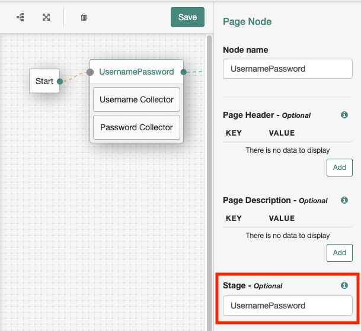
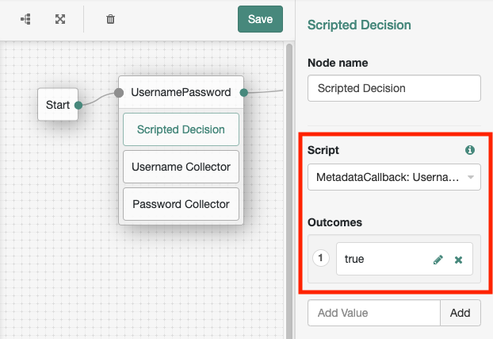

# Using Authentication Tree Stage to Build a Custom UI with the ForgeRock JavaScript SDK

The [ForgeRock JavaScript SDK](https://sdks.forgerock.com/javascript/index/) greatly simplifies adding intelligent authentication to your applications. You can choose its ready-to-use UI to completely offload rendering of authentication steps, or you can take more control by creating a custom UI.

OpenAM 7.0 introduces a "stage" property to authentication trees that makes it easier to determine what to render in your custom UI. This post will illustrate how this works, and also how you can accomplish the same thing in previous versions of OpenAM.

## Using Stage in OpenAM 7.0

When constructing a tree, you can place nodes inside a Page Node and then specify its "Stage", which is a free-form text field.



When you use the SDK's `FRAuth` module to iterate through a tree, you can now use the `getStage()` method on the returned `FRStep` object to determine what custom UI to render:

```ts
const thisStep = await FRAuth.next(previousStep);

switch (thisStep.getStage()) {
  case "UsernamePassword":
    // Render your username/password UI
    break;
  case "AnotherStage":
    // etc
    break;
}
```

## Alternative Approaches for OpenAM 6.5

Prior to OpenAM 7.0, the "stage" property did not exist in authentication trees. Instead, there are two other possible approaches you can use.

### Approach #1: Metadata Callbacks

Using a metadata callback, you can inject the "stage" value into the tree payload. The only difference is that the value will appear in a callback, instead of directly associated with the step itself.

This approach involves:

1. Create a script to add the metadata callback
1. Update your tree to execute that script
1. Read the metadata callback in your application

#### Step 1: Add a Metadata Callback using a Script

Create a script of type "Decision node script for authentication trees". Give it an appropriate name, such as "MetadataCallback: UsernamePassword". In the script, add a metadata callback that sets a `stage` property and sets an `outcome` value:

```js
var fr = JavaImporter(
  org.forgerock.json.JsonValue,
  org.forgerock.openam.auth.node.api.Action,
  com.sun.identity.authentication.spi.MetadataCallback
);

with (fr) {
  var json = JsonValue.json({ stage: "UsernamePassword" });
  action = Action.send(new MetadataCallback(json)).build();
}

outcome = "true";
```

#### Step 2: Update your Tree to Execute Script

Add a Scripted Decision Node to your Page Node, and configure it to reference the script created in the previous step. In this example, the step will contain three callbacks:

- MetadataCallback
- NameCallback
- PasswordCallback



#### Step 3: Read the Metadata Callback

Now use the SDK to find the metadata callback and read its "stage" property.

```js
function getStage(step) {
  // Get all metadata callbacks in the step
  const metadataCallbacks = step.getCallbacksOfType("MetadataCallback");

  // Find the first callback that contains a "stage" value in its data
  const stage = metadataCallbacks
    .map(x => {
      const data = x.getData();
      const dataIsObject = typeof data === "object" && data !== null;
      return dataIsObject && data.stage ? data.stage : undefined;
    })
    .find(x => x !== undefined);

  // Return the stage value, which will be undefined if none exists
  return stage;
}
```

### Approach #2: Inspecting Callbacks

## Determining Stage of Authentication

```ts
// stage.ts

import {
  CallbackType,
  FRStep,
  FRWebAuthn,
  MetadataCallback,
  WebAuthnStepType
} from "@forgerock/javascript-sdk";

// Stages used by your application
enum Stage {
  DeviceAuthentication = "DeviceAuthentication",
  DeviceRegistration = "DeviceRegistration",
  Password = "Password",
  PasswordlessChoice = "PasswordlessChoice",
  Username = "Username",
  UsernamePassword = "UsernamePassword",
  Unknown = "Unknown"
}

// Defines the shape of a metadata callback used for defining "stage"
interface MetadataCallbackStage {
  stage: Stage;
}

// Progressively attempts to determine "stage" with three different approaches.
// In your application, you'd likely use only one of these approaches.
function getStage(step: FRStep): Stage {
  // Approach #1
  // AM 7.0 users can leverage the page node "stage" property.
  if (step.getStage()) {
    return step.getStage() as Stage;
  }

  // Approach #2
  // AM 6.5 users can use a metadata callback to specify "stage".
  const metadataCallbacks = step.getCallbacksOfType<MetadataCallback>(
    CallbackType.MetadataCallback
  );
  if (metadataCallbacks.length > 0) {
    const metadataStage = getStageFromCallback(metadataCallbacks[0]);
    if (metadataStage !== Stage.Unknown) {
      return metadataStage;
    }
  }

  // Approach #3
  // Inspect the callbacks present to determine "stage".
  const choiceCallbacks = step.getCallbacksOfType(CallbackType.ChoiceCallback);
  const usernameCallbacks = [
    ...step.getCallbacksOfType(CallbackType.ValidatedCreateUsernameCallback),
    ...step.getCallbacksOfType(CallbackType.NameCallback)
  ];
  const passwordCallbacks = [
    ...step.getCallbacksOfType(CallbackType.ValidatedCreatePasswordCallback),
    ...step.getCallbacksOfType(CallbackType.PasswordCallback)
  ];
  if (usernameCallbacks.length > 0 && passwordCallbacks.length > 0) {
    return Stage.UsernamePassword;
  } else if (usernameCallbacks.length > 0) {
    return Stage.Username;
  } else if (passwordCallbacks.length > 0) {
    return Stage.Password;
  } else if (choiceCallbacks.length > 0) {
    return Stage.PasswordlessChoice;
  } else if (metadataCallbacks.length > 0) {
    const webAuthnStepType = FRWebAuthn.getWebAuthnStepType(step);
    if (webAuthnStepType === WebAuthnStepType.Authentication) {
      return Stage.DeviceAuthentication;
    } else if (webAuthnStepType === WebAuthnStepType.Registration) {
      return Stage.DeviceRegistration;
    }
  }

  return Stage.Unknown;
}

function getStageFromCallback(callback: MetadataCallback): Stage {
  const value = callback.getOutputValue("data");
  const valueIsObject = typeof value === "object" && value !== null;
  const valueIsStage =
    valueIsObject && Object.getOwnPropertyNames(value).indexOf("stage") !== -1;
  return valueIsStage ? (value as MetadataCallbackStage).stage : Stage.Unknown;
}

export { getStage, Stage };
```
